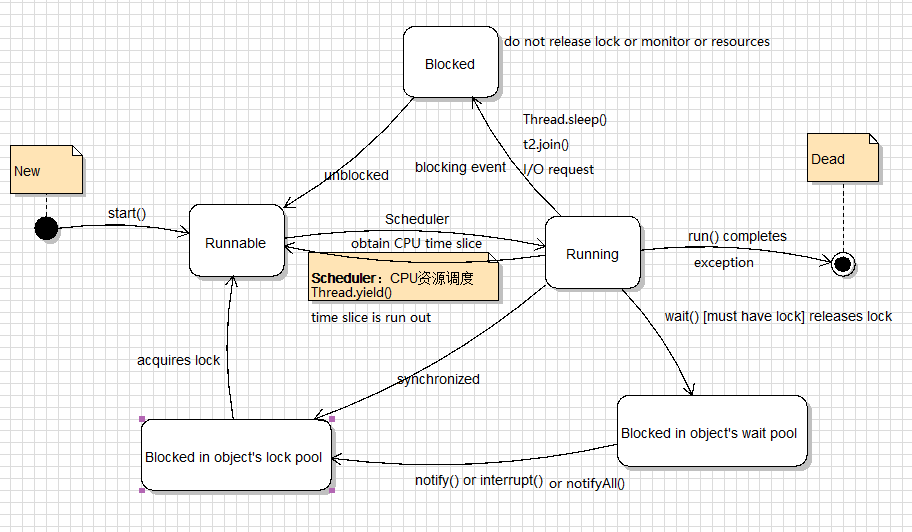

# Java Concurrency Note 

Conclusion: During multithreading development, use high-level API in priority, then mid-level API (`java.util.concurrent.atomic` and `java.util.concurrent.locks`), finally low-level API (`synchronized`, `volatile`, `wait`, `notify` and `notifyAll`).

[Java 并发性和多线程](https://www.cnblogs.com/android-blogs/p/5765148.html)

[java多线程并发](https://www.cnblogs.com/zch-lxh1314/p/7090653.html)

## Processes & Threads 

A process has a self-contained execution environment. Each process has its own memory space.

To facilitate communication between processes, most operating systems support Inter Process Communication (IPC) resources, such as pipes and sockets. 

Threads share the same process's resources, including memory and open files.

Two basic ways for using Thread objects to create a concurrent application: 

- Simply instantiate `Thread` each time the application needs to initiate an asynchronous task.
- To abstract thread management from the rest of your application, pass the application's tasks to an executor.

Life cycle of a thread:



Java thread priorities: 

- MIN_PRIORITY: 1
- MAX_PRIORITY: 10
- NORM_PRIORITY: 5 (default)

Two ways to **use a thread** for your class **intendedly**:

- Have this class to implements a `Runnable` interface. And then pass the object of this class into constructor of `Thread` class when creating an object of `Thread `class. **This way is more general.**

```java
public class HelloRunnable implements Runnable {

    public void run() {
        System.out.println("Hello from a thread!");
    }

    public static void main(String args[]) {
        (new Thread(new HelloRunnable())).start();
    }
}
```

- Have this class to extend a `Thread` class that itself implements `Runnable` interface. This way is easier to use in simple applications, but is limited by the fact that your task class must be a descendant of `Thread` class.

```java
public class HelloThread extends Thread {

    public void run() {
        System.out.println("Hello from a thread!");
    }

    public static void main(String args[]) {
        (new HelloThread()).start();
    }
}
```

[JAVA多线程实现的四种方式](https://www.cnblogs.com/felixzh/p/6036074.html)

### Main Thread

The default priority of Main thread is 5 and for all remaining user threads priority will be inherited from parent to child.

The priority of the thread (child thread) created by the Main thread will be the same as the Main thread. For example: 

```java
Thread mainThread = Thread.currentThread();  // Main thread
mainThread.getPriority();  // 5
mainThread.setPriority(7);
mainThread.getPriority();  // 7

Thread childThread = new Thread();
childThread.getPriority();  // 7
```

1. Main thread is created by JVM.
2. Main thread verifies the existence of the main() method.
3. Main thread initializes the class with main() method. 

Create a deadlock by using Main thread:

```java
Thread.currentThread().join();
```

### Prevent Thread Execution

#### `yield()`

Scenario: 

Thread t1 is executing and completion time is 5 hours. Thread t2 is in Runnable state and completion time is 5 minutes. Thread t2 is more important. You need to prevent execution of t1.

Process: 

1. A thread calls `Thread.yield()`.
2. Thread scheduler checks if there is any thread with same or high priority than this thread. 
3. If there is any thread with higher or same priority then the scheduler will move the current thread to **Runnable** state and give processor to other thread and if not – current thread will keep executing.

Main thread is always pausing its execution and giving chance to child thread (with same priority).

#### `Thread.sleep(<time_millisec>)`

The sleep period can be terminated by interrupts.

You **CANNOT** assume that invoking `Thread.sleep(<time_millisec>)` will suspend the thread for precisely the time period specified because they are limited by the facilities provided by the underlying OS (operation system).

#### `join()` 

If `t` is a `Thread` object, `t.join();` causes the current thread to pause execution until `t`'s thread terminates. That is to say, `t` will be the upstream of the current thread. 

You can also use `t.join(<time_millisec>)` to specify a waiting period. Similar with `sleep()`, `join` is dependent on the OS for timing, you **CANNOT** assume that `join` will wait exactly as long as you specify.

---

## Synchronization

Synchronization is used to prevent **thread interference** and **memory consistency errors**, but it will introduce thread contention including starvation and livelock.

### Thread Interference

Interference: Two different operations (e.g. add and subtract), running in different threads, but acting on the same data. 

Thread interference bugs can be difficult to detect and fix because they are unpredictable.

### Memory Consistency Errors

How to avoid memory consistency errors: established a **happens-before** relationship that guarantee that memory writes by one specific statement are visible to another specific statement.

### Synchronized Methods

Happens-before relationship: When one thread is executing a synchronized method for an object, all other threads that invoke synchronized methods for the same object block (suspend execution) until the first thread is done with the object. This guarantees that changes to the state of the object are visible to all threads.

**NOTE** that constructors **CANNOT** be synchronized.

Applying synchronized methods can present problems with liveness.

```java
public class SynchronizedCounter {
    private int c = 0;

    public synchronized void increment() {
        c++;
    }

    public synchronized void decrement() {
        c--;
    }

    public synchronized int value() {
        return c;
    }
}
```

### Intrinsic Locks

**Every object has an intrinsic lock associated with it.**

A thread that needs exclusive and consistent access to an object's fields has to acquire the object's intrinsic lock before accessing them, and then own this lock, and then release this lock when it has done with them. **As long as a thread owns an intrinsic lock, no other thread can acquire the same lock.** 

**Reentrant synchronization**: But a thread can acquire a lock that it already owns -  （嵌套同步）. Synchronized code invokes a method that also contains synchronized code, and both sets of code use the same lock.

When a thread invokes a synchronized method, it automatically acquires the intrinsic lock for that method's object and releases it when the method returns (including return due to exceptions).

### Synchronized Statements（同步代码块）

Must specify the object that provides the intrinsic lock. 

```java
public void addName(String name) {
    synchronized(this) {
        lastName = name;
        nameCount++;
    }
    nameList.add(name);
}
```

```java
public class MsLunch {
    // if c1 and c2 are never used together, and all updates of these two fields must be synchronized
	// you do not need to use synchronized methods or using the lock associated with "this", which will reduces concurrency by creating unnecessary blocking 
    private long c1 = 0;
    private long c2 = 0;
    
	// instead, you can create two objects (lock1 and lock2) solely to provide locks
    private Object lock1 = new Object();
    private Object lock2 = new Object();

    public void inc1() {
        synchronized(lock1) {
            c1++;
        }
    }

    public void inc2() {
        synchronized(lock2) {
            c2++;
        }
    }
}
```

---

## Liveness

Liveness: A concurrent application's ability to execute in a timely manner. 

### Deadlock

Two or more threads are blocked forever, waiting for each other.

```java
public class Deadlock {
    static class Friend {
        private final String name;
        public Friend(String name) {
            this.name = name;
        }
        public String getName() {
            return this.name;
        }
        public synchronized void bow(Friend bower) {
            System.out.format("%s: %s"
                + "  has bowed to me!%n", 
                this.name, bower.getName());
            bower.bowBack(this);
        }
        public synchronized void bowBack(Friend bower) {
            System.out.format("%s: %s"
                + " has bowed back to me!%n",
                this.name, bower.getName());
        }
    }

    public static void main(String[] args) {
        final Friend alphonse =
            new Friend("Alphonse");
        final Friend gaston =
            new Friend("Gaston");
        new Thread(new Runnable() {
            public void run() { alphonse.bow(gaston); }
        }).start();
        new Thread(new Runnable() {
            public void run() { gaston.bow(alphonse); }
        }).start();
    }
}
```

When `Deadlock` runs, it is extremely likely that both threads will block when they attempt to invoke `bowBack()`. Neither block will ever end, because each thread is waiting for the other to exit `bow()`.

### Starvation

When shared resources are made unavailable for long periods by a thread that invokes a synchronized method of an object frequently which often takes a long time to return, other threads that also need frequent synchronized access to the same object will often be blocked.

### Livelock 

A thread often acts in response to the action of another thread, which is also a response to the action of another thread. 

Livelocked threads are unable to make further progress, but the threads are not blocked — they are simply too busy responding to each other to resume work.

---

## Guarded Blocks

"Guarded Block" is the most common idiom for threads to coordinate their actions.

### Polling 

The process of testing a condition repeatedly till it becomes true. Use a loop to check whether a particular condition is true or not.

Disadvantage: Waste many CPU cycles and makes the implementation inefficient.

### `wait()`, `notify()`, `notifyAll()`

Java uses these three method s to avoid polling.

These method **must be used within a synchronized block only**.

Use `Object.wait()` method to suspend the current thread. The thread releases the lock it holds. The invocation of `wait()` does not return until another thread has issued a notification that some special event may have occurred.

```java
public synchronized void guardedJoy() {
    while(!joy) {
        try {
            wait();
        } catch (InterruptedException e) {}
    }
    System.out.println("Joy and efficiency have been achieved!");
}
```

Use `Object.notifyAll()` method to inform all threads waiting on that lock that something important has happened. **The thread does not releases the lock immediately until the synchronized block terminates.** Then after this `notifyJoy()` thread has released the lock, the previous thread with `wait()` method reacquires the lock and resumes by returning from the invocation of `wait()`. It is **advised** to use notify only at the end of your method. 

```java
public synchronized notifyJoy() {
    joy = true;
    notifyAll();
}
```

`Object.notify()` method is used to wake up a single thread without specifying which thread. So, it is useful only in the situation where you do not care which thread gets woken up, e.g. massively parallel applications.

Check "Producer-Consumer" example under `guardedBlock` package. 

---

## Immutable Objects

Immutable objects are particularly useful in concurrent applications. They cannot be corrupted by thread interference or observed in an inconsistent state.

**DO NOT** worry about the cost of creating a new object as opposed to updating an object in place. The impact of object creation is often overestimated, and can be offset by some of the efficiencies associated with immutable objects.

If you want the mutable instance of a class to avoid being seen in an inconsistent state when more than one thread intends to modify its state, **bound the code together into a synchronized statement**. Check "SynchronizedRGB" example under `immutable` package. 

How to define immutable class:

- **DO NOT** provide setter method. 
- Make all fields `final` and `private`.
- **DO NOT** allow subclasses to override methods. 
  - Declare the class as `final`. 
  - Or make the constructor `private` and construct instances using factory pattern.
- If the instance fields include references to mutable objects, **DO NOT** allow those objects to be changed. 
  - **DO NOT** provide methods that modify the mutable objects.
  - **DO NOT** share references to the mutable objects. **NEVER** store references to external, mutable objects passed to the constructor; if necessary, create copies, and store references to the copies. Similarly, create copies of your internal mutable objects when necessary to avoid returning the originals in your methods.

Check "ImmutableRGB" example under `immutable` package. 

---

## High Level Concurrency Objects

Since version 5.0, the Java platform has also included high-level concurrency APIs.

### Lock Objects

Synchronized code relies on a simple kind of reentrant lock. This kind of lock is easy to use, but has many limitations. More sophisticated locking idioms are supported by the `java.util.concurrent.locks` package.

Only one thread can own a `Lock` object at a time.

`Lock` objects can be used to solve the deadlock problem.

Advantages of `Lock` objects:

- The `tryLock` method backs out if the lock is not available immediately or before a timeout expires (if specified). (The return value type is boolean.)
- The `lockInterruptibly` method backs out if another thread sends an interrupt before the lock is acquired.

Check "Safelock" example under `safelock` package. 

### Executors

In large-scale applications, it makes sense to separate thread management and creation from the rest of the application.

Executors are objects that encapsulate these functions.

#### Executor Interfaces 

The `java.util.concurrent` package defines three executor interfaces:

- `Executor`, a simple interface that supports launching new tasks.
  - You can use `e.execute(r);` to replace `(new Thread(r)).start();`
  - `(new Thread(r)).start();` creates a new thread and launches it immediately. 
  - `e.execute(r);` is more likely to use an existing worker thread to run `r`, or to place `r` in a queue to wait for a worker thread to become available.

- `ExecutorService`, a subinterface of Executor, which adds features that help manage the lifecycle, both of the individual tasks and of the executor itself.
- `ScheduledExecutorService`, a subinterface of ExecutorService, supports future and/or periodic execution of tasks.

#### Thread Pools

Thread Pools consist of worker threads that exists separately from the `Runnable` and `Callable` tasks it executes and is often used to execute multiple tasks.

Problem / Reasons to have thread pools: 

- A server that creates a new thread for every request would spend more time and consume more system resources in creating and destroying threads than processing actual requests.
- Thread objects use a significant amount of memory. A JVM creating too many threads at the same time can cause the system to run out of memory. 
- In a large-scale application, allocating and deallocating many thread objects creates a significant memory management overhead.

Solution: 

- Use worker threads minimizes the overhead caused by thread creation.

Create an executor that uses a thread pool:

- Invoke `ExecutorService pool = Executors.newFixedThreadPool(int poolSize)` factory method.
- Invoke `Executors.newCachededThreadPool()` factory method. Creates a thread pool that creates new threads as needed, but will reuse previously constructed threads when they are available. Suitable for applications that launch many short-lived tasks.
- Invoke `Executors.newSingleThreadExecutor()` factory method. Executes a single task at a time.

Remember to close the thread pool at the end: `pool.shutdown();`.

##### Fixed Thread Pool

It is a common type of thread pool, which has a specified number of threads running.

If a thread is somehow terminated while it is still in use, it is automatically replaced with a new thread.

Tasks are submitted to the pool via an internal queue. If all threads are being currently run by the executor then the pending tasks are placed in a queue and are executed when a thread becomes idle.

Use Case: 

A web server application where each HTTP request is handled by a separate thread. 

- Not using thread pool: If the application simply creates a new thread for every new HTTP request, and the system receives more requests than it can handle immediately, the application will suddenly stop responding to all requests when the overhead of all those threads exceed the capacity of the system. 
- Using thread pool: The application will not be servicing HTTP requests as quickly as they come in, but it will be servicing them as quickly as the system can sustain.

##### Risks

- Deadlock: All the executing threads are waiting for the results from the blocked threads waiting in the queue due to the unavailability of threads for execution.
- Thread Leakage: Thread Leakage occurs if a thread is removed from the pool to execute a task but not returned to it when the task completed. As an example, if the thread throws an exception and pool class does not catch this exception, then the thread will simply exit, reducing the size of the thread pool by one. If this repeats many times, then the pool would eventually become empty and no threads would be available to execute other requests.
- Resource Thrashing: If the thread pool size is very large then time is wasted in context switching between threads. Having more threads than the optimal number may cause starvation problem leading to resource thrashing as explained.

##### Tuning 

On a N processor system for a queue of only computation type processes, a maximum thread pool size of N or N+1 will achieve the maximum efficiency.

#### Fork/Join Framework（分而治之的思想）

Goal: Use all the available processing power to enhance the performance of your application.

- It is designed for work that can be broken into smaller pieces recursively. 
- It distributes tasks to worker threads in a thread pool. 
- Work-stealing algorithm: Worker threads that run out of things to do can steal tasks from other threads that are still busy.

Example using this framework: 

- In `java.util.Arrays` class, `parallelSort()` vs. `sort()`. 

### Concurrent Collections 

- `BlockingQueue`
  - implementation: `ArrayBlockingQueue`, `LinkedBlockingQueue`
- `BlockingDeque`
  - implementation: `LinkedBlockgingDeque`
- `ConcurrentMap` 
  - implementation: `ConcurrentHashMap`
- `ConcurrentNavigableMap`
  - implementation: `ConcurrentSkipListMap` - concurrent analog of `TreeMap`
  
These collections avoid Memory Consistency Errors by defining a happens-before relationship between an operation that adds an object to the collection and subsequent operations that access or remove that object.  

### Atomic Variables

Reads and writes are atomic for reference variables and for most primitive variables (all types except `long` and `double`).

Reads and writes are atomic for all variables declared `volatile` (including `long` and `double` variables). For instance, `public volatile int count;`.

Atomic actions are free from thread interference but memory consistency errors are still possible. Use `volatile` to avoid as any write to a `volatile` variable establishes a happens-before relationship with subsequent reads of that same variable. So, changes to a `volatile` variable are always visible to other thread.

The `java.util.concurrent.atomic` package defines classes that support atomic operations on single variables.

A `set` has a happens-before relationship with any subsequent `get` on the same variable.

(Check the above `SynchronizedCounter` class.) For a complicated class, you might want to avoid the liveness impact of unnecessary synchronization due to many synchronized methods. Here, you can replace `int` type with `AtomicInteger` type.

```java
import java.util.concurrent.atomic.AtomicInteger;

class AtomicCounter {
    private AtomicInteger c = new AtomicInteger(0);

    public void increment() {
        c.incrementAndGet();
    }

    public void decrement() {
        c.decrementAndGet();
    }

    public int value() {
        return c.get();
    }
}
```

### Concurrent Random Numbers

- `ThreadLocalRandom` class can be used for applications that expect to use random numbers from multiple threads or `ForkJoinTasks`.
- For concurrent access, using `ThreadLocalRandom` instead of `Math.random()` results in less contention and better performance.
- For instance, `int r = ThreadLocalRandom.current().nextInt(4, 77);`.